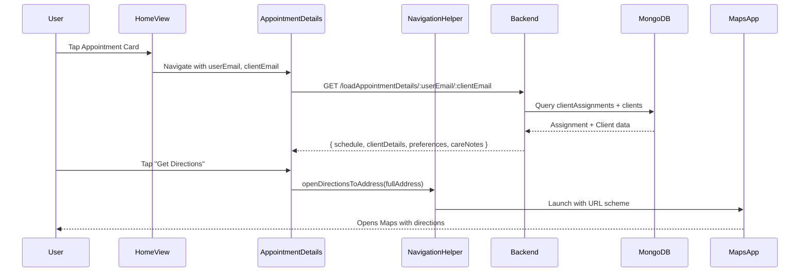

# Enhanced Appointment Details - Architecture Document

## Overview

The Enhanced Appointment Details feature provides caregivers with comprehensive client information during appointments, including care notes, navigation integration, client preferences, and visit history.

---

## Architecture Diagram

```mermaid
graph TB
    subgraph "Flutter Frontend"
        A[HomeView] --> B[ClientAndAppointmentDetails]
        B --> C[_buildClientInfoCard]
        B --> D[_buildPreferencesCard]
        B --> E[_buildHistoryCard]
        B --> F[_buildNavigationButton]
        F --> G[NavigationHelper]
    end

    subgraph "External Services"
        G --> H[Google Maps]
        G --> I[Apple Maps]
    end

    subgraph "Backend API"
        B --> J[/loadAppointmentDetails]
        B --> K[/getClientDetails]
        B --> L[/getWorkedTime]
    end

    subgraph "MongoDB Collections"
        J --> M[(clientAssignments)]
        K --> N[(clients)]
        L --> O[(workedTime)]
    end
```

---

## Data Flow



---

## Component Details

### Frontend Components

| Component | File | Purpose |
|-----------|------|---------|
| `ClientAndAppointmentDetails` | `client_appointment_details_view.dart` | Main container view |
| `_buildClientInfoCard` | Same file | Displays client contact info + navigation button |
| `_buildPreferencesCard` | Same file | Shows care notes and preferences |
| `_buildHistoryCard` | Same file | Lists past visits with client |
| `_buildNavigationButton` | Same file | "Get Directions" button |
| `NavigationHelper` | `navigation_helper.dart` | Cross-platform Maps integration |

### Backend Endpoints

| Endpoint | Method | Description |
|----------|--------|-------------|
| `/loadAppointmentDetails/:userEmail/:clientEmail` | GET | Full appointment + client data |
| `/getClientDetails/:email` | GET | Client profile with preferences |
| `/getWorkedTime/:userEmail/:clientEmail` | GET | Visit history from workedTime |

### Database Collections

| Collection | Key Fields | Purpose |
|------------|------------|---------|
| `clients` | `careNotes`, `preferences`, address fields | Client profile data |
| `clientAssignments` | `schedule`, `userEmail`, `clientEmail` | Assignment schedules |
| `workedTime` | `shiftDate`, `totalSeconds`, `notes` | Completed visit records |

---

## Data Models

### Client Preferences (stored in `clients.preferences`)

```json
{
  "communicationStyle": "verbal",
  "dietaryNeeds": ["gluten-free", "vegetarian"],
  "specialRequirements": "Prefers morning appointments",
  "languages": ["English", "Nepali"]
}
```

### Care Notes (stored in `clients.careNotes`)

```json
"Patient requires mobility assistance. Allergic to latex."
```

### Visit History (from `workedTime` collection)

```json
{
  "shiftDate": "2026-01-20",
  "startTime": "2026-01-20T09:00:00Z",
  "endTime": "2026-01-20T12:00:00Z",
  "totalSeconds": 10800,
  "notes": "Completed personal care routine"
}
```

---

## Navigation Integration

### Platform Behavior

| Platform | Primary | Fallback |
|----------|---------|----------|
| iOS | Apple Maps | Google Maps |
| Android | Google Maps | - |
| Web | Google Maps | - |

### URL Schemes

```
# Google Maps (Directions)
https://www.google.com/maps/dir/?api=1&destination={encoded_address}

# Apple Maps (Directions)
https://maps.apple.com/?daddr={encoded_address}
```

---

## File Structure

```
lib/app/
├── features/Appointment/views/
│   └── client_appointment_details_view.dart   # Main view
├── shared/utils/
│   └── navigation_helper.dart                 # Maps integration
└── ...

lib/l10n/
└── app_en.arb                                 # Localization strings

backend/
├── server.js                                  # API endpoints
└── services/
    ├── appointmentService.js                  # Appointment logic
    └── clientService.js                       # Client CRUD + preferences
```
