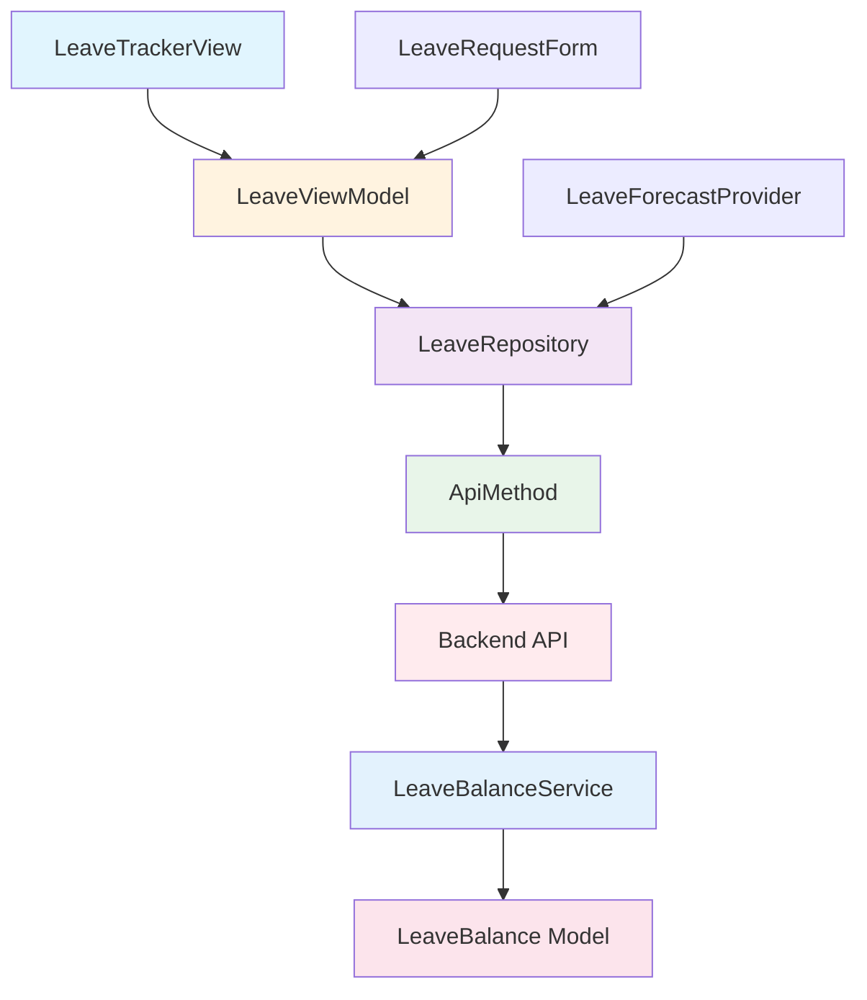

# Leave Balance Tracker - Product Requirements Document

## 1. Product Overview

The Leave Balance Tracker is a comprehensive employee leave management system that provides real-time visibility into accrued leave balances, pending requests, future leave forecasts, and organization-specific public holiday calendars. This feature addresses the critical need for employees and managers to accurately track and plan leave entitlements within Australian workplace compliance standards.

**Target Users**: Employees seeking to monitor their leave entitlements, managers approving leave requests, and HR administrators managing organizational leave policies.

**Business Value**: Reduces administrative overhead, ensures compliance with Australian leave regulations, prevents leave balance disputes, and enables better workforce planning through accurate leave forecasting.

## 2. Current Status Analysis

### 2.1 Frontend Implementation (Flutter)

**Existing Components:**
- **LeaveTrackerView**: Bauhaus-designed interface with balance cards, forecast widget, and request history
- **LeaveViewModel**: Business logic layer handling state management and user actions
- **LeaveRepository**: Data access layer interfacing with backend via ApiMethod
- **LeaveRequestForm**: Form for submitting new leave requests

**Current Features:**
- Real-time leave balance display (Annual, Personal/Sick, Long Service)
- Interactive leave forecast with date picker
- Request history with status indicators
- Bauhaus design implementation with clean, functional UI

**Architecture Compliance:**
- ✅ Follows MVVM + Riverpod pattern
- ✅ Uses ApiMethod for backend communication
- ✅ Implements Bauhaus design principles
- ✅ Proper separation of concerns

### 2.2 Backend Implementation (Node.js/Express)

**Existing Services:**
- **LeaveBalanceService**: Core business logic for balance calculations and management
- **LeaveBalanceController**: API endpoint handlers
- **LeaveBalance Model**: MongoDB schema with proper indexing

**Current Capabilities:**
- Automatic balance initialization for new users
- Balance tracking with accrued/used hours
- Support for multiple leave types (annual, sick, personal, long service)
- Proper error handling and validation

**Database Schema:**
- Indexed by userId and leaveType for performance
- Supports negative balances (configurable)
- Includes audit trail with timestamps

### 2.3 Identified Gaps and Limitations

**Missing Features:**
- Public holiday calendar integration
- Long service leave accrual calculations
- Leave approval workflow
- Balance expiration tracking
- Organizational leave policies configuration

**Technical Limitations:**
- No automatic accrual calculations
- Limited forecast accuracy
- No bulk operations for HR administrators
- Missing localization support

## 3. Requirement Refinement

### 3.1 Functional Requirements

#### 3.1.1 Leave Balance Management
| Requirement ID | Description | Priority | Acceptance Criteria |
|----------------|-------------|----------|---------------------|
| FR-LB-001 | Display current leave balances for all types | High | Show accurate balances for Annual, Sick, Personal, and Long Service leave |
| FR-LB-002 | Automatic balance initialization | High | Create default balances for new users with configurable starting amounts |
| FR-LB-003 | Real-time balance updates | High | Reflect balance changes immediately upon request approval/rejection |
| FR-LB-004 | Balance history tracking | Medium | Maintain audit trail of all balance changes with reasons |

#### 3.1.2 Leave Request Management
| Requirement ID | Description | Priority | Acceptance Criteria |
|----------------|-------------|----------|---------------------|
| FR-LR-001 | Submit leave requests | High | Allow users to request leave with type, dates, hours, and reason |
| FR-LR-002 | Request status tracking | High | Display pending, approved, rejected status with timestamps |
| FR-LR-003 | Request validation | High | Validate sufficient balance before allowing request submission |
| FR-LR-004 | Request cancellation | Medium | Allow users to cancel pending requests |

#### 3.1.3 Leave Forecasting
| Requirement ID | Description | Priority | Acceptance Criteria |
|----------------|-------------|----------|---------------------|
| FR-LF-001 | Dynamic leave forecasting | High | Calculate projected balances based on accrual rates and future dates |
| FR-LF-002 | Accrual rate configuration | Medium | Support different accrual rates per leave type and employment conditions |
| FR-LF-003 | Forecast accuracy indicators | Low | Show confidence levels and assumptions used in calculations |

#### 3.1.4 Public Holiday Calendar
| Requirement ID | Description | Priority | Acceptance Criteria |
|----------------|-------------|----------|---------------------|
| FR-PH-001 | Organization-specific holidays | High | Display company-specific public holidays |
| FR-PH-002 | State-based holiday support | Medium | Handle different public holidays per Australian state |
| FR-PH-003 | Holiday impact on leave | Medium | Automatically exclude public holidays from leave calculations |

### 3.2 Non-Functional Requirements

#### 3.2.1 Performance Requirements
- **Response Time**: Balance queries must return within 500ms
- **Concurrent Users**: Support 1000+ simultaneous users
- **Data Accuracy**: Balance calculations must be accurate to 0.01 hours

#### 3.2.2 Security Requirements
- **Data Protection**: Encrypt sensitive leave data in transit and at rest
- **Access Control**: Users can only access their own leave data
- **Audit Trail**: Log all balance changes with user identification

#### 3.2.3 Compliance Requirements
- **Australian Standards**: Comply with National Employment Standards (NES)
- **Privacy**: Meet Australian Privacy Principles (APP)
- **Data Retention**: Maintain leave records for minimum 7 years

## 4. Bauhaus Design Principles Implementation

### 4.1 "Form Follows Function" Application

**Functional Layout**: The interface prioritizes essential information with balance cards prominently displayed, followed by forecasting tools and request history. Each element serves a specific user need without decorative excess.

**Typography Hierarchy**: Clear typographic scale distinguishes between balance amounts, labels, and supporting information, ensuring users can quickly scan and comprehend their leave status.

**Color Functionality**: Color usage follows functional principles - primary color for actionable elements, secondary colors for different leave types, and status colors (green for approved, red for rejected, amber for pending).

### 4.2 "Less is More" Implementation

**Minimal Interface**: Remove unnecessary visual elements, focusing on essential data presentation. White space is used strategically to create breathing room and improve readability.

**Simplified Interactions**: Single-click actions for common tasks, with progressive disclosure for complex operations. The forecast feature uses an intuitive date picker rather than complex form inputs.

**Component Reusability**: BauhausCard, BauhausChip, and BauhausActionButton components maintain consistency while serving multiple functions across the interface.

### 4.3 Design System Specifications

**Color Palette:**
- Primary: #2563EB (Functional blue for primary actions)
- Secondary: #7C3AED (Purple for annual leave)
- Accent: #DC2626 (Red for long service leave)
- Surface: #F8FAFC (Light background)
- Text Primary: #1E293B (High contrast text)
- Text Muted: #64748B (Supporting information)

**Typography:**
- Headlines: Sans-serif, 24-32px, medium weight
- Body Text: Sans-serif, 14-16px, regular weight
- Labels: Sans-serif, 12-14px, medium weight

**Spacing:**
- Base unit: 4px
- Component padding: 16px
- Section spacing: 24px
- Card spacing: 12px

## 5. System Architecture

### 5.1 Communication Protocol

All frontend-backend communication MUST occur exclusively through the ApiMethod class (`/Users/bishal/Developer/invoice/lib/backend/api_method.dart`). Direct API calls are strictly prohibited to maintain security, consistency, and proper error handling.

### 5.2 Data Flow Architecture



### 5.3 API Method Integration

The following ApiMethod functions are utilized for leave management:

```dart
// Leave Balance Operations
Future<Map<String, dynamic>> getLeaveBalances(String userEmail)
Future<Map<String, dynamic>> getLeaveForecast(String userEmail, DateTime targetDate)

// Leave Request Operations  
Future<Map<String, dynamic>> getUserLeaveRequests(String userEmail)
Future<Map<String, dynamic>> submitLeaveRequest({...})
```

### 5.4 Security Architecture

**Authentication Flow**: All requests include Firebase authentication tokens validated by backend middleware.

**Data Isolation**: Users can only access their own leave data through email-based queries with proper authorization checks.

**Input Validation**: Both frontend and backend validate all inputs to prevent injection attacks and ensure data integrity.

## 6. Acceptance Criteria

### 6.1 Leave Balance Display
- [ ] Shows current balances for Annual, Sick, Personal, and Long Service leave
- [ ] Updates in real-time when requests are processed
- [ ] Displays balances with 2 decimal place accuracy
- [ ] Handles edge cases (zero balances, negative balances if allowed)

### 6.2 Leave Request Submission
- [ ] Validates sufficient balance before submission
- [ ] Prevents overlapping leave requests
- [ ] Provides clear error messages for validation failures
- [ ] Shows confirmation upon successful submission

### 6.3 Leave Forecasting
- [ ] Calculates accurate projections based on accrual rates
- [ ] Allows date selection up to 2 years in advance
- [ ] Displays forecast with appropriate confidence indicators
- [ ] Updates forecast when balances change

### 6.4 Public Holiday Integration
- [ ] Displays organization-specific holidays
- [ ] Automatically excludes holidays from leave calculations
- [ ] Shows holiday impact on leave requests
- [ ] Updates annually with new holiday data

### 6.5 Performance Criteria
- [ ] Balance queries respond within 500ms
- [ ] Request submission completes within 2 seconds
- [ ] Forecast calculations complete within 1 second
- [ ] UI remains responsive during data loading

### 6.6 Accessibility Standards
- [ ] WCAG 2.1 AA compliance for all UI components
- [ ] Screen reader compatibility for balance information
- [ ] Keyboard navigation support for all interactive elements
- [ ] High contrast mode support

## 7. Localization Requirements

### 7.1 AppLocalization Integration
All user-facing text must utilize the AppLocalization system:

```dart
// Example implementation
title: AppLocalizations.of(context)!.leaveBalanceTitle,
subtitle: AppLocalizations.of(context)!.leaveBalanceSubtitle,
```

### 7.2 Supported Languages
- English (primary)
- Chinese (simplified)
- Additional languages based on user base expansion

### 7.3 Regional Formatting
- Date formats appropriate to user locale
- Number formatting with proper decimal separators
- Currency formatting for leave payout calculations

## 8. Future Enhancements

### 8.1 Advanced Features
- Mobile push notifications for balance updates
- Integration with payroll systems
- Advanced analytics and reporting
- Bulk operations for HR administrators

### 8.2 AI/ML Integration
- Predictive leave planning recommendations
- Anomaly detection for unusual leave patterns
- Automated accrual rate optimization

### 8.3 Extended Compliance
- Multi-country leave regulation support
- Enterprise policy configuration
- Advanced audit and reporting capabilities

---

**Document Version**: 1.0  
**Last Updated**: January 2026  
**Author**: Product Management Team  
**Review Date**: February 2026